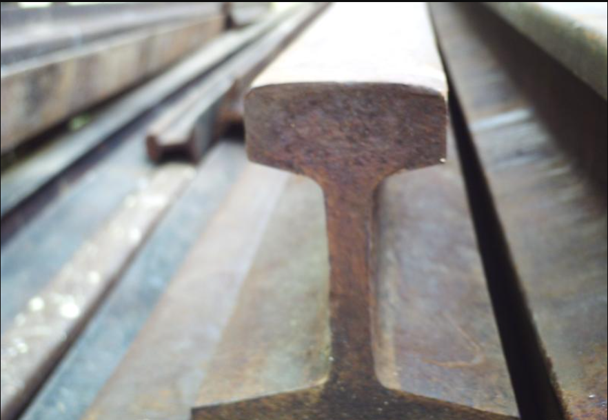
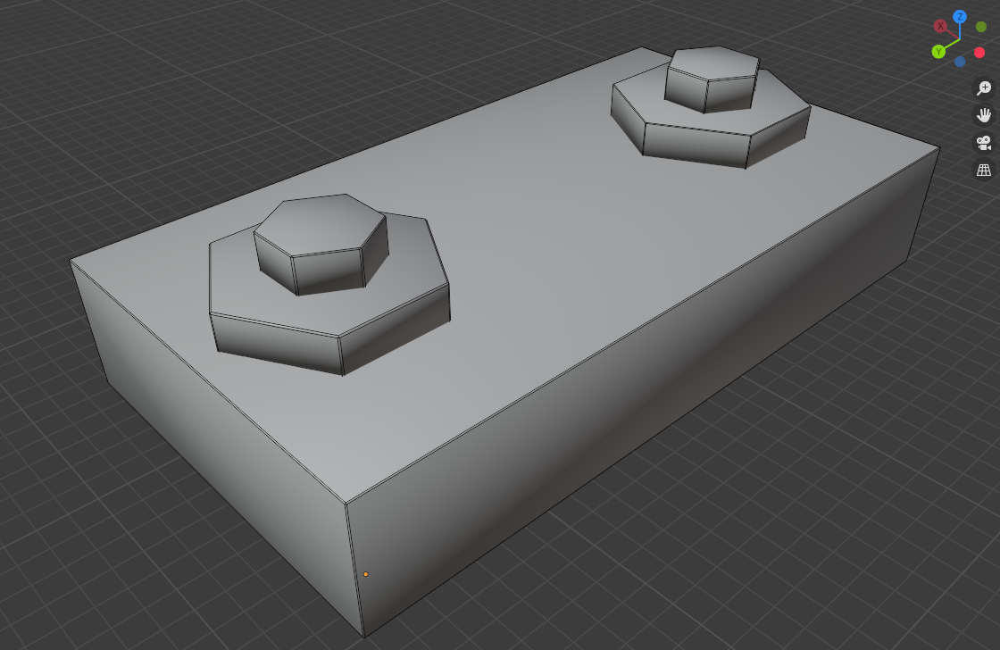
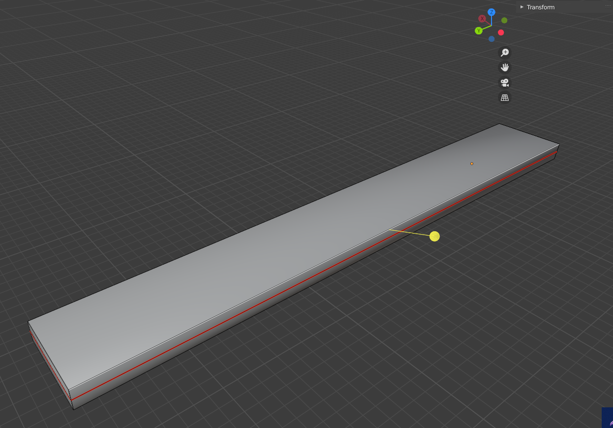
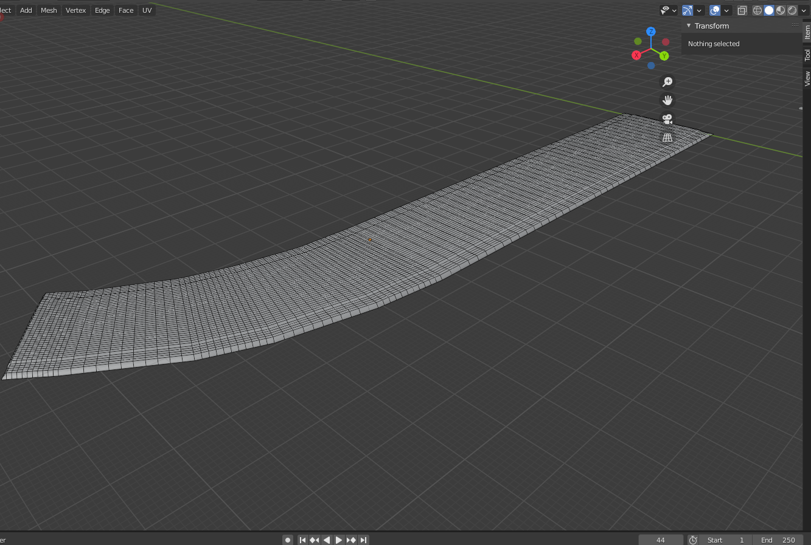
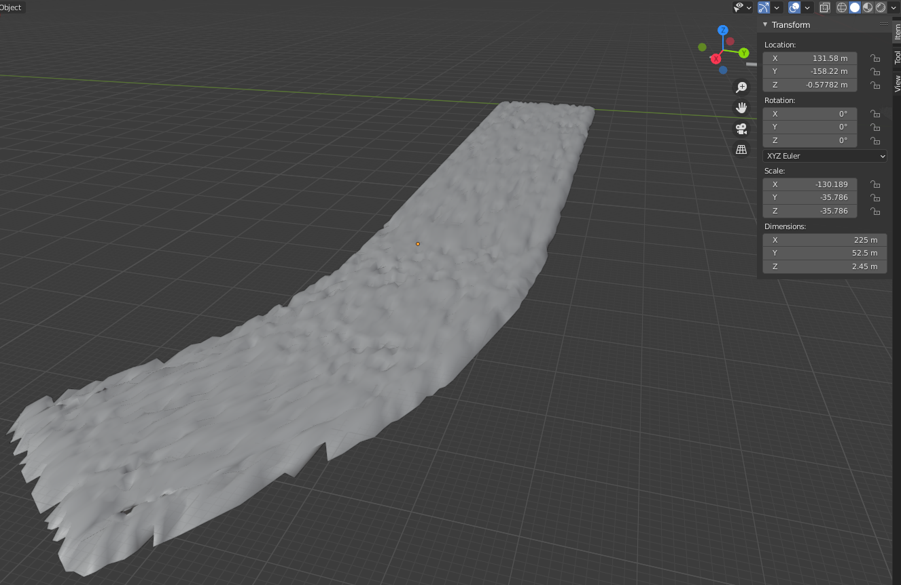
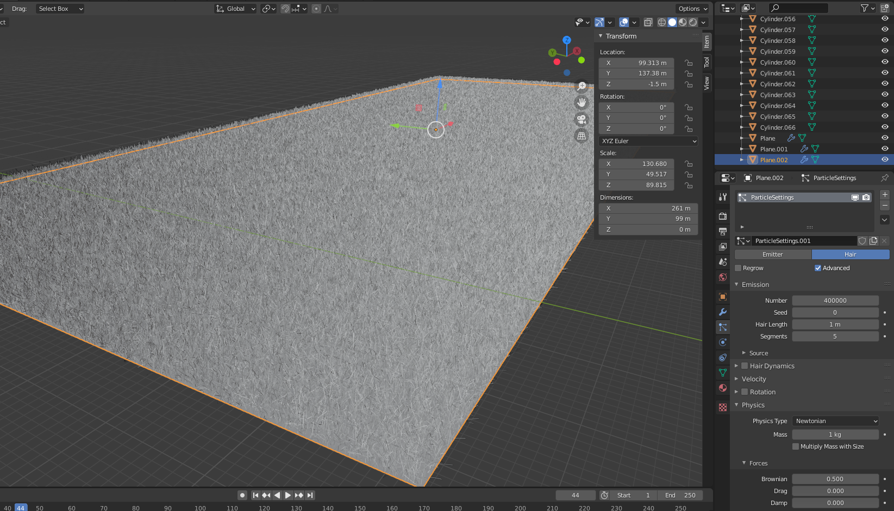
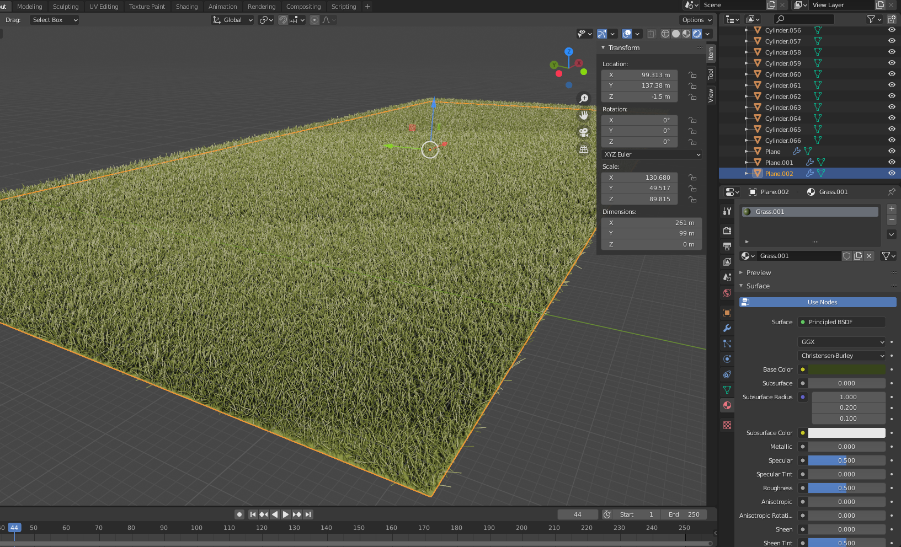

# 3D-Model-Train-Tracks:
 

## Sofware utilizado: 
### Blender
 

## Etapas para a construção:
## 1: Modelagem
 

###  Trilho:

 
 
 </a>      <caption> Referência para modelagem </caption> </a>
 

### Parafusos e barra de fixação das tábuas:
 
 </a>
 

### Tábuas:
 
 </a>
 
 

## 2:Mapas UV

### Trilho:
 

 </a>

 

### Barra de fixação:

 

### Tábuas:
 

 
 

## 3: Texturização
 

### Trilho:
 
 </a>      <caption> Textura utilizada-<a href="https://www.textures.com/download/rust0219/128507?q=rust"> Rust0219 </a> </caption> </a>
 
 

### Barra de fixação:
 
 </a>      <caption> Textura utilizada-<a href="https://www.textures.com/download/rust0222/128540?q=rust"> Rust0222 </a> </caption> </a>
 
 

### Tábuas:
 
 </a>      <caption> Textura utilizada-<a href="https://www.textures.com/download/woodplanksold0277/122518?q=wood"> WoodPlanksOld0277 </a> </caption> </a>
 
 

## 4: Construção do ambiente
 

### Brita
 

 

### Displacement brita

 

### Mapa UV brita:
 

 

### Texturização brita:
 
 </a>      <caption> Textura utilizada-<a href="https://www.textures.com/download/gravel0168/64801?q=gravel"> Gravel0168 </a> </caption> </a>
 
 

### Terreno:
 

 

 
 

## 5: Montagem e composição final
 

 
 

